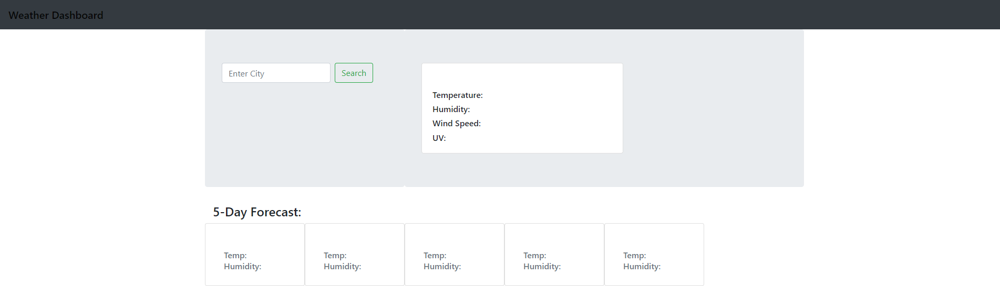
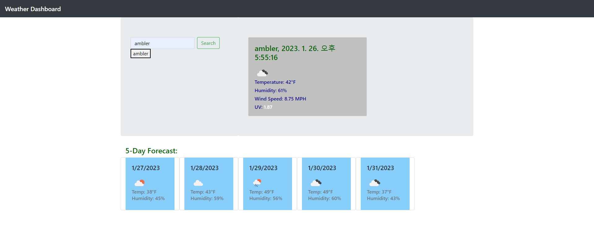

# Weather Dashboard

## Description

This application lets you view weather of city that user enters. The search history is save and when user clicks on the history than that city will show.

## Screenshot

Below is screenshot of my deployed web

And this is when user enters the city

## Tech Used

## Link
<a href="https://connorcho66.github.io/weather-dashboard/">Link to depoloyed website</a>

## License

N/A

## Contact

<ul>
    <li><b>Email: </b> <a href="connorcho22@gmail.com">connorcho22@gmail.com</a></li>
    <li><b>Github: </b> <a href="https://github.com/connorcho66">connorcho66</a></li>
    <li><b>Linked In: </b> <a href="www.linkedin.com/in/seongyun-cho-89a8a61a0">SeongYun Cho</a></li>
</ul>